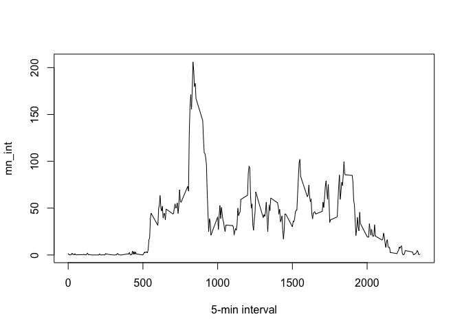
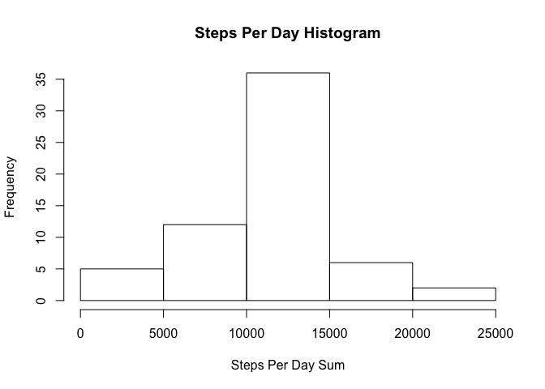

Activity Monitoring Data Assignment
====================================

##Loading and preprocessing the data

Loading the data:


```r
echo = TRUE
setwd("~/Desktop/ActivityMonitoringData")
activity <- NULL
activity <- read.csv("activity.csv", header = T, sep = ",")
```

Set variables to NULL:


```r
echo = TRUE
df_summary <- NULL
sos2 <- NULL
sos <- NULL
mn_int <- NULL
activity2 <- NULL
mean_sos2 <- NULL
median_sos2 <- NULL
activity2_weekend <- NULL
activity2_weekday <- NULL
mean_activity2_weekday <- NULL
mean_activity2_weekend <- NULL
```

## What is mean total number of steps taken per day?

Sum of steps (sos):


```r
echo = TRUE
sos <- tapply(activity$steps, activity$date, sum, na.rm=T)
```

Histogram:


```r
echo = TRUE
hist(sos, xlab = "Sum of Steps Per Day", main = "Histogram of Steps Per Day")
```

<!-- -->

Mean and median total number of steps taken per day:


```r
echo = TRUE
mean_sos <- round(mean(sos))
median_sos <- round(median(sos))

print(c("Mean:",mean_sos))
```

```
## [1] "Mean:" "9354"
```

```r
print(c("Median:",median_sos))
```

```
## [1] "Median:" "10395"
```

##What is the average daily activity pattern?

Time series plot of the 5-minutes interval (x-axis) and the average number of steps taken, averaged across all days (y-axis):


```r
echo = TRUE
mn_int <- tapply(activity$steps, activity$interval, mean, na.rm=T)
plot(mn_int ~ unique(activity$interval), type="l", xlab = "5-min interval")
```

<!-- -->

5-minute interval, on average across all the days in the dataset, that contains the maximum number of steps:


```r
echo = TRUE
mn_int[which.max(mn_int)]
```

```
##      835 
## 206.1698
```

##Imputting missing values

Do missing values (NA) exist in the data set? Yes:


```r
echo = TRUE
table(is.na(activity) == TRUE)
```

```
## 
## FALSE  TRUE 
## 50400  2304
```

```r
summary(activity)
```

```
##      steps                date          interval     
##  Min.   :  0.00   2012-10-01:  288   Min.   :   0.0  
##  1st Qu.:  0.00   2012-10-02:  288   1st Qu.: 588.8  
##  Median :  0.00   2012-10-03:  288   Median :1177.5  
##  Mean   : 37.38   2012-10-04:  288   Mean   :1177.5  
##  3rd Qu.: 12.00   2012-10-05:  288   3rd Qu.:1766.2  
##  Max.   :806.00   2012-10-06:  288   Max.   :2355.0  
##  NA's   :2304     (Other)   :15840
```

The NA's, of which there are 2304, are located in the steps variable.

The following code represents the strategy of filling the NA's.

The "mn_int", which stands for mean interval, contains the mean for every interval calculated over the course of the sixty one days. 

The right value of "mn_int" will replace the NA of that interval.


```r
echo = TRUE
activity2 <- activity  # creation of the dataset that will have no more NAs
for (i in 1:nrow(activity)){
    if(is.na(activity$steps[i])){
        activity2$steps[i]<- mn_int[[as.character(activity[i, "interval"])]]
    }
}
```

Histogram of total number of steps taken each day:


```r
echo = TRUE
sos2 <- tapply(activity2$steps, activity2$date, sum, na.rm=T)
hist(sos2, xlab = "Steps Per Day Sum", main = "Steps Per Day Histogram")
```

<!-- -->


```r
mean_sos2 <- round(mean(sos2))
median_sos2 <- round(median(sos2))
```

New mean and median values:


```r
echo = TRUE
print(c("Mean:",mean_sos2))
```

```
## [1] "Mean:" "10766"
```

```r
print(c("Median:",median_sos2))
```

```
## [1] "Median:" "10766"
```

Summary of mean and median with and without NA's:


```r
echo = TRUE
df_summary <- rbind(df_summary, data.frame(mean = c(mean_sos, mean_sos2), median = c(median_sos, median_sos2)))
rownames(df_summary) <- c("With NA's", "Without NA's")
print(df_summary)
```

```
##               mean median
## With NA's     9354  10395
## Without NA's 10766  10766
```


```r
echo = TRUE
summary(activity2)
```

```
##      steps                date          interval     
##  Min.   :  0.00   2012-10-01:  288   Min.   :   0.0  
##  1st Qu.:  0.00   2012-10-02:  288   1st Qu.: 588.8  
##  Median :  0.00   2012-10-03:  288   Median :1177.5  
##  Mean   : 37.38   2012-10-04:  288   Mean   :1177.5  
##  3rd Qu.: 27.00   2012-10-05:  288   3rd Qu.:1766.2  
##  Max.   :806.00   2012-10-06:  288   Max.   :2355.0  
##                   (Other)   :15840
```

There is a difference in the mean and median after the missing NA's are inputed which can be observed above.

##Are there differences in activity patters between weekdays and weekends?

Need to add a new column containing the factor "Weekday days" or "Weekend Days"


```r
echo = TRUE
activity2$weekday <- c("weekday")
activity2[weekdays(as.Date(activity2[, 2])) %in% c("Saturday", "Sunday", "samedi", "dimanche", "saturday", "sunday", "Samedi", "Dimanche"), ][4] <- c("weekend")
table(activity2$weekday == "weekend")
```

```
## 
## FALSE  TRUE 
## 12960  4608
```


```r
activity2$weekday <- factor(activity2$weekday)
```

New data frame and data calculated:


```r
echo = TRUE
activity2_weekend <- subset(activity2, activity2$weekday == "weekend")
activity2_weekday <- subset(activity2, activity2$weekday == "weekday")

mean_activity2_weekday <- tapply(activity2_weekday$steps, activity2_weekday$interval, mean)
mean_activity2_weekend <- tapply(activity2_weekend$steps, activity2_weekend$interval, mean)
```

Plotting the dataframe:


```r
echo = TRUE
library(lattice)
df_weekday <- NULL
df_weekend <- NULL
df_final <- NULL
df_weekday <- data.frame(interval = unique(activity2_weekday$interval), avg = as.numeric(mean_activity2_weekday), day = rep("weekday", length(mean_activity2_weekday)))
df_weekend <- data.frame(interval = unique(activity2_weekend$interval), avg = as.numeric(mean_activity2_weekend), day = rep("weekend", length(mean_activity2_weekend)))
df_final <- rbind(df_weekday, df_weekend)

xyplot(avg ~ interval | day, data = df_final, layout = c(1, 2), 
       type = "l", ylab = "Number of steps")
```

<!-- -->

There is a difference between the periods.
